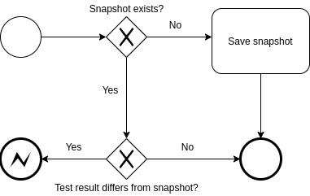

## Java Snapshot
- Inspired by [facebook's Jest framework](https://facebook.github.io/jest/docs/en/snapshot-testing.html)
- Combines best features and is backwards compatible with
[json-snapshot.github.io](https://github.com/json-snapshot/json-snapshot.github.io) and 
[java-snapshot-testing](https://github.com/origin-energy/java-snapshot-testing)
- Framework agnostic
- Supports non-deterministic data handling and much more

#Snapshot Testing for Java
The aim of this project is to expand capabilities of Snapshot testing for jvm projects.

## Advantages of Snapshot Testing
It's useful for deterministic tests. That is, running the same tests multiple times on a component that has not changed 
should produce the same results every time. Java snapshot supports non-deterministic data handling,
therefore, the data can be ignored, and only deterministic would be saved in a snapshot.

- Great for testing JSON interfaces ensuring you don't break clients
- Fast and easy to test
- Will implicitly test areas of your code you did not think about

## Disadvantages of Snapshot Testing
- Does not give great insight to why the snapshot failed
- Can be difficult to troll though large snapshot changes
- Does not document the business rules the way a Unit test would

A Snapshot test does not assert Java types. You can continue doing that with any other testing framework.

## Installation [Maven](https://search.maven.org/search?q=java-snapshot-testing)


## How does it work



1. First run of the tests creates snapshot file with `.json` extension. Created files have the same name as test file. 
Default Snapshot file directory is `src/test/java`, but can be overridden
1. On subsequent test runs, the saved Snapshot in a file is compared with the one produced by the test
1. If they don't match the test fails
1. It is then your job to decide if you have introduced a regression or intentionally changed the output
1. If you have introduced a regression you will need to fix your code
1. If you have intentionally changed the output you can manually modify Snapshot file, to make it pass or delete it and it will be generated again from scratch
1. Snapshot files should be committed along with test classes.

# Usage Examples
## Basic usage

`expected` method accepts any types of arguments.
```java

public class JavaSnapshotTest {

    @Test
    void basicTest() {
        String expected = "expected";
        expect(expected).toMatchSnapshot();
    }
}
```


## Parameterized tests
In cases where the same test runs multiple times with different parameters you need to set the `scenario`, which must be unique for each run

```java
expect(something).withScenario(params).toMatchSnapshot();
```

### Scenario Example
```java
class JavaSnapshotTest {

    @ParameterizedTest(name = "{0} test")
    @ValueSource(strings = {
            "first",
            "second",
            "third",
            "fourth"
    })
    void parameterizedTest(String scenario) {
        String expected = "expected";
        expect(expected).withScenario(scenario).toMatchSnapshot();
    }
}
```
## Non-deterministic data handling
In cases data contains non-deterministic fields, ex. timestamps, generated IDs, thanks to 
[json-view](https://github.com/monitorjbl/json-view), fields could be removed from snapshot.

### Exclusion example
```java
class JavaSnapshotTest {

    @Test
    void testWithExclusion() {
        TestObject ref = new TestObject();
        ref.setInt1(1);
        ref.setDate(new Date());
        ref.setStr1("str1");
        ref.setList(asList("red", "blue", "green"));
        ref.setStringArray(new String[]{"apple", "banana"});
        ref.setSub(new TestSubobject("subvalue", new TestSubobject("subsubvalue")));

        expect(ref)
                .withDynamicFields()
                .onClass(TestObject.class, match().exclude("list", "date", "sub.sub"))
                .build()
                .toMatchSnapshot();
    }
}
```
The snapshot for this test would look like this:

```json
"JsonSnapshotFileTest.testWithExclusion": [
    {
      "sub": {
        "val": "subvalue"
      },
      "str1": "str1",
      "int1": 1,
      "stringArray": [
        "apple",
        "banana"
      ]
    }
  ]
```

### Inclusion example
The inversion is also possible. Wildcards are very handy if you have limited set of fields you want to include. 

```java
class JavaSnapshotTest {

    @Test
    void testWithInclusion() {
        TestObject ref = new TestObject();
        ref.setInt1(1);
        ref.setDate(new Date());
        ref.setStr1("str1");
        ref.setList(asList("red", "blue", "green"));
        ref.setStringArray(new String[]{"apple", "banana"});
        ref.setSub(new TestSubobject("subvalue", new TestSubobject("subsubvalue")));

        expect(ref)
                .withDynamicFields()
                .onClass(TestObject.class, match().exclude("*").include("int1", "str1", "list"))
                .build()
                .toMatchSnapshot();
    }
}
```
The snapshot for this test would look like this:

```json
"JsonSnapshotFileTest.testWithInclusion": [
    {
      "str1": "str1",
      "int1": 1,
      "list": [
        "red",
        "blue",
        "green"
      ]
    }
  ]
```

### Class matchers
Fields also could be ignored referenced by class. In the example below, field `val` with value `subvalue` on the class `TestSubobject` is ignored:

```java
class JavaSnapshotTest {

    @Test
    void testWithClassMatchers() {
        TestObject ref = new TestObject();
        ref.setInt1(1);
        ref.setDate(new Date());
        ref.setStr1("str1");
        ref.setList(asList("red", "blue", "green"));
        ref.setStringArray(new String[]{"apple", "banana"});
        ref.setSub(new TestSubobject("subvalue", new TestSubobject("subsubvalue")));

        expect(ref)
                .withDynamicFields()
                .onClass(TestObject.class, match().exclude("list", "date", "sub.sub"))
                .onClass(TestSubobject.class, match().exclude("val"))
                .build()
                .toMatchSnapshot();
    }
}
```

## Inline snapshots
Java snapshot also supports inline snapshot handling, like in Jest. This would come in handy with Java 14 feature - [text blocks](https://openjdk.java.net/jeps/368).

```java
class JavaSnapshotTest {

    @Test
    void testWithInlineSnapshot() {
        String expected = "expected";
        expect(expected).toMatchInlineSnapshot("[\n  \"expected\"\n]");
    }
}
```

## Configuration
Java Snapshot can be used out of the box with default configuration, but some features can be configured.

1. Snapshot file path, default directory is `src/test/java`
2. Snapshot file extension, default extension is `json`
3. `StorageType` can be configured, `BY_PACKAGE_HIERARCHY` means that each Snapshot file not only will be placed in 
provided directory, but also according to test class package. Default is `FLAT_DIRECTORY`, which means that all snapshot files will be stored 
in same directory
4. Java Snapshot file structure differs from [json-snapshot.github.io](https://github.com/json-snapshot/json-snapshot.github.io) 
and [java-snapshot-testing](https://github.com/origin-energy/java-snapshot-testing), but compatibility can be configured, Java Snapshot
will save snapshot files by structuring them the same way other libraries do


```java
class JavaSnapshotTest {

    @BeforeAll
    static void setup() {
        new SnapshotConfiguration.Builder()
                .withFilePath(FILE_PATH)
                .withFileExtension(FILE_EXTENSION)
                .withStorageType(StorageType.BY_PACKAGE_HIERARCHY)
                .withJsonSnapshotCompatibility()
                .build();
    }
}
```

## Updating all snapshots and generating a new baseline
Often - after analysing each snapshot and verifying it is correct - you will need to generate a new baseline for the snapshots.

Instead of deleting or manually modifying each snapshot you can pass `-PupdateSnapshot="pattern` which is equivalent to the `--updateUnapshot` flag in Jest

This will update all snapshots containing the text passed as the value.

For gradle it can be done via `build.gradle` file the way shown bellow.

```gradle
test {
    useJUnitPlatform()
    systemProperty 'updateSnapshot', findProperty('pattern')
}
```


Also, updating individual tests could be achieved by using `update` method, as in provided example:

```java
class JavaSnapshotTest {

    @Test
    void updateSnapshot() {
        String expected = "expected";
        expect(expected).update();
    }
}
```
